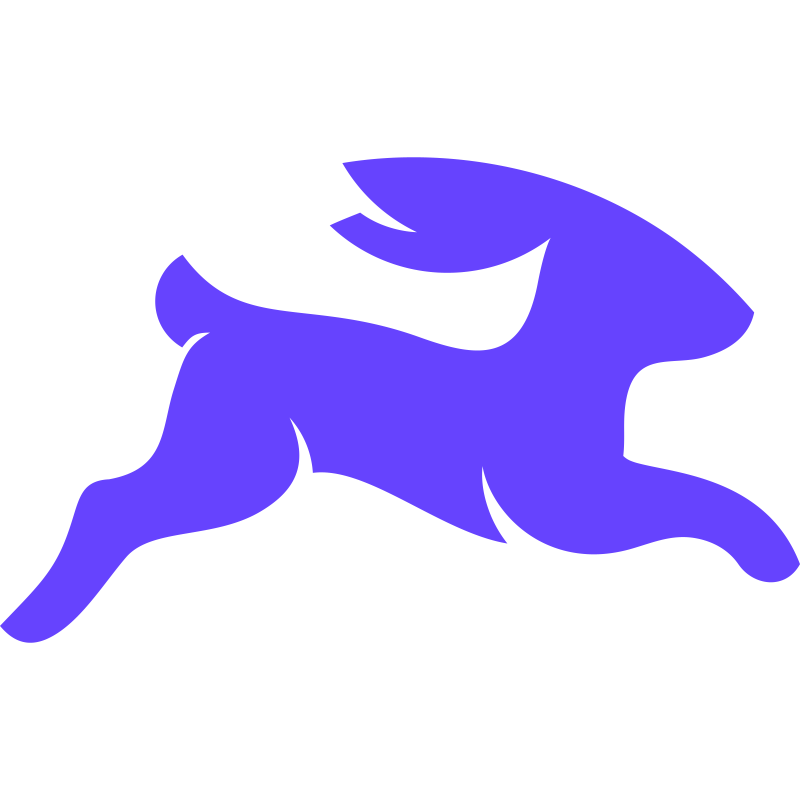
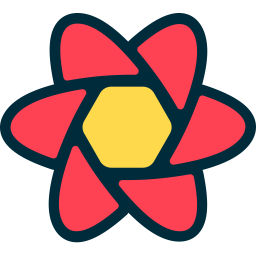

<div align="center">
  
  
  <!-- Rounded Avatar -->
  <kbd>
    
  </kbd>
  
  <br><br>
  
  
  
  [](https://pritammondal.dev)
  [](https://github.com/qntum-dev)
  [](https://www.linkedin.com/in/pritammondal-dev)
      
  
  
</div>

##  About Me


```typescript
const pritam = {
  location: "Building awesome stuff on the web 🌍",
  code: [
    "TypeScript",
    "JavaScript",
    "Basic Python",
    "Basic Java",
    "Basic Golang",
  ],
  askMeAbout: ["web dev", "tech", "health"],
  technologies: {
    frontEnd: {
      frameworks: ["React", "Next.js"],
      styling: ["TailwindCSS", "ShadCN"],
    },
    backEnd: {
      frameworks: ["Expressjs", "Encore.dev", "Nest JS", "Hono"],
      databases: ["PostgreSQL", "Redis", "MongoDB"],
    },
    misc: ["Docker", "Figma", "Git", "Postman", "N8N", "Bash"],
  },
  currentFocus: "Building production ready web applications! 🚀",
  funFact: "I debug with console.log and I'm not ashamed! 😄",
};
```

##  My Awesome Projects

<table align="center">
  <tr>
    <td align="center" width="50%">
      <h3>🗨️ Rflect - Chat in Real-Time!</h3>
      <a href="https://rflect.onrender.com/">
        
      </a>
      <br><br>
      <p>
        <a href="https://rflect.onrender.com/"></a>
        <a href="https://github.com/qntum-dev/rflectFrontend"> CODE-4ECDC4?style=for-the-badge" /></a>
      </p>
      <p><strong>Real-time chat with image sharing & dark mode!</strong></p>
      <p>Next.js • Encore.dev • Redis • WebSockets</p>
    </td>
    <td align="center" width="50%">
      <h3>🎬 MVDB - Movie Magic!</h3>
      <a href="https://mvdb.vercel.app/">
        
      </a>
      <br><br>
      <p>
        <a href="https://mvdb.vercel.app/"></a>
        <a href="https://github.com/qntum-dev/mvdb"> CODE-4ECDC4?style=for-the-badge" /></a>
      </p>
      <p><strong>Discover movies & shows like never before!</strong></p>
      <p>Next.js • TypeScript • Tailwind CSS</p>
    </td>
  </tr>
</table>

<div align="center">
  <h4>🛠️ More Cool Stuff I Built:</h4>
  <a href="https://github.com/qntum-dev/url_shortner">🔗 URL Shortener</a> • 
  <a href="https://github.com/qntum-dev/todofy">✅ Todofy</a>
</div>

##  Tech Stack & Tools

<div align="center">
  
</div>

<div align="center">
  <kbd><a href="https://developer.mozilla.org/en-US/docs/Web/JavaScript"></a></kbd>
  <kbd><a href="https://www.typescriptlang.org/"></a></kbd>
  <kbd><a href="https://react.dev/"></a></kbd>
  <kbd><a href="https://tailwindcss.com/"></a></kbd>
  <kbd><a href="https://nestjs.com/"></a></kbd>
  <kbd><a href="https://www.postgresql.org/"></a></kbd>
  <kbd><a href="https://orm.drizzle.team/"></a></kbd>
  <kbd><a href="https://directus.io/"></a></kbd>
  <kbd><a href="https://tanstack.com/"></a></kbd>
  <kbd><a href="https://www.figma.com/"></a></kbd>
  <kbd><a href="https://git-scm.com/"></a></kbd>
  <kbd><a href="https://www.postman.com/"></a></kbd>
</div>


##  GitHub Stats

<div align="center">
   
  
  <br>
  
</div>

<div align="center">
  
</div>

<br>

<div align="center">
  
  
  
  
  
</div>

##  Let's Connect & Build Something Amazing!

<div align="center">
  
  
  
  
  
  <br><br>
  <a href="https://pritammondal.dev">
    
  </a>
  <a href="https://github.com/qntum-dev">
    
  </a>
  <a href="https://www.linkedin.com/in/pritammondal-dev">
    
  </a>
</div>

<br>

<div align="center">
  
  <br><br>
  
</div>
